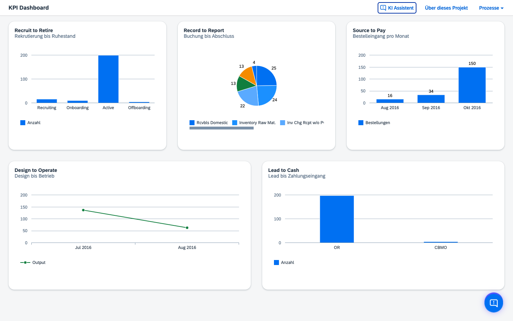
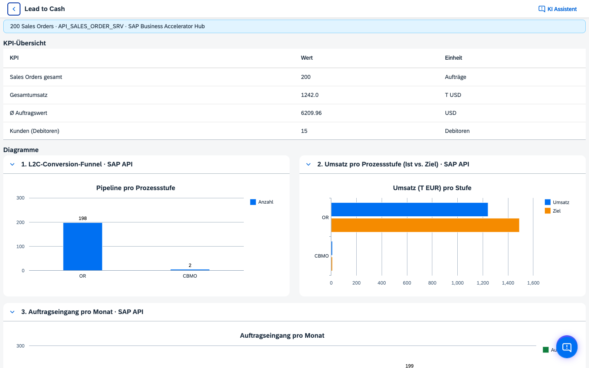

# UI5 VizFrame KPI Dashboard

SAPUI5-Web-App zur Visualisierung von Kennzahlen und Diagrammen entlang von **fünf End-to-End-Geschäftsprozessen** (L2C, S2P, R2R, RtR, D2O). Zusätzlich gibt es einen **KI-Assistenten** (Navigation, FAQ zu Prozessen und App).

**Live-Demo:** [GitHub Pages](https://malik-1909.github.io/UI5-Dashboard/) · **Quellcode:** [github.com/Malik-1909/UI5-Dashboard](https://github.com/Malik-1909/UI5-Dashboard)

## Screenshots

| Startseite | Prozess-Detail (L2C) |
|------------|----------------------|
|  |  |

## Was die App macht

- **Startseite** mit fünf Prozesskacheln und Mini-Charts.
- **Detailseiten** je Prozess: KPI-Tabelle und mehrere **sap.viz**-Diagramme (ohne Textwände – Prozessinfos auf der Projektseite).
- **Datenmodell `sales`** (überall `JSONModel`):
  - **Lokal** (`npm run start`): Mock-Bundle + optional SAP-Sandbox via `SapDataLoader`; Router startet erst nach dem Merge (kein Layout-Sprung).
  - **GitHub Pages** (`*.github.io`): nur statisches Mock-Bundle; kein SAP- oder Chat-Backend.
  - **BTP (Cloud Foundry)**: echte SAP-Daten aus dem stündlichen GitHub-Cache (`/api/sap-cache`), weil der Trial-Egress die Sandbox direkt blockt (siehe unten).
- **Hinweise in der UI**: MessageStrip und Panel-Titel zeigen **SAP API** vs. **Mock**.
- **KI-Chat**:
  - **Lokal**: `POST /api/chat` über Middleware (**Groq**, Key in `.env`).
  - **GitHub Pages**: **StaticChatMock** – regelbasierte Offline-Antworten.

## Deployment-Matrix

| Umgebung | SAP-Daten | KI-Assistent | Backend nötig |
|----------|-----------|--------------|---------------|
| **Lokal** (`npm run start`) | Sandbox (mit `SAP_API_KEY`) oder Mock | Groq (mit `GROQ_API_KEY`) oder Mock | UI5 Dev-Server + Middleware |
| **GitHub Pages** | Mock only | StaticChatMock | Nein (statisch) |
| **BTP (Node/CF)** | Echte SAP-Daten via stündlichem GitHub-Cache (`/api/sap-cache`) | Groq via Proxy | Ja – Node-Backend auf CF |

Details zu GitHub Pages: `npm run deploy` · BTP-Setup inkl. Trial Keep-Alive: siehe [DEPLOYMENT.md](DEPLOYMENT.md).

## Datenquellen (lokal, mit `SAP_API_KEY`)

| Prozess | API / Quelle (Kurz) |
|--------|----------------------|
| **L2C** | S/4 OData `API_SALES_ORDER_SRV` – Vertrieb / Aufträge |
| **S2P** | `API_PURCHASEORDER_PROCESS_SRV` – Einkauf; im Sandbox-Header **keine Nettobeträge** → u. a. **Beleganzahl** je Organisation |
| **R2R** | `API_JOURNALENTRYITEMBASIC_SRV` mit Filter `CompanyCode eq '1010'` |
| **RtR** | SuccessFactors OData v2 `User` |
| **D2O** | `API_MATERIAL_DOCUMENT_SRV` + `API_MATERIAL_STOCK_SRV` (Produktionsaufträge oft **403**) |

Proxy und Keys: `middleware/chat-proxy` – Routen `/api/chat` und `/api/sap/*` → `sandbox.api.sap.com` (lokal). Der API-Key bleibt dabei immer serverseitig.

## SAP-Daten auf BTP: Proxy, Egress-Sperre und Cache-Lösung

Ein zentrales Prinzip der App: Der SAP-Zugriff läuft **nie direkt aus dem Browser**, sondern über einen **serverseitigen Proxy** (`middleware/chat-proxy`, Route `/api/sap/*`). Das hält den `SAP_API_KEY` aus dem Client-Bundle heraus, umgeht CORS und kapselt die Sandbox-URL an einer Stelle – der `SapDataLoader` spricht nur die eigene App an, nicht `sandbox.api.sap.com`.

**Das Problem auf BTP.** Im BTP Trial (Cloud Foundry) lud die Live-Demo trotzdem endlos: Der Proxy bekam von der Sandbox nur `UND_ERR_CONNECT_TIMEOUT` → **502**. Ein temporär eingebauter `/api/diag`-Endpoint *im Container* hat die Ursache eindeutig belegt – DNS auflösbar, aber der **reine TCP-Connect zur Sandbox-IP läuft in den Timeout**, während andere Ziele (z. B. Groq) problemlos erreichbar waren. Der Trial-Egress blockt also gezielt den Weg zur SAP-Sandbox; IPv6 als Ursache war ausgeschlossen (kein AAAA-Record).

**Die Lösung – Daten dort holen, wo der Egress offen ist.** Statt aus dem BTP-Container heraus fragt eine **GitHub Action** (`.github/workflows/sap-cache.yml`) die Sandbox **stündlich** ab (`scripts/fetch-sap-cache.mjs`, alle 6 Services) und publiziert das Ergebnis als eine `sap-cache.json` in den Branch `sap-cache-data`. Der BTP-Node-Server liest diesen Cache über die Route **`/api/sap-cache`** von `raw.githubusercontent.com` (In-Memory-TTL + *stale-while-error*), und der `SapDataLoader` schaltet auf BTP automatisch auf diese Route um.

```
GitHub Action (stündlich) → Branch sap-cache-data (sap-cache.json)
        ↓ raw.githubusercontent.com
BTP Node-Server /api/sap-cache (In-Memory-TTL, stale-while-error)
        ↓
SapDataLoader → Badge „SAP API“ statt „Mock“
```

Ergebnis: echte SAP-Daten in der Live-Demo, ohne kostenpflichtige Destination/Egress und ohne dass die App bei einem Sandbox-Hänger stehen bleibt. Details siehe [DEPLOYMENT.md](DEPLOYMENT.md); benötigtes Secret: `SAP_API_KEY`.

## Technologie-Stack

- SAPUI5 **1.120** (XML-Views, JS-Controller), **sap.viz**, **sap.ui.layout**, **themelib_sap_horizon**
- **`JSONModel` `sales`** – gesetzt in `webapp/Component.js`
- **`ResourceModel` `i18n`** – UI-Texte zentral in `webapp/i18n/`
- **`webapp/utils/SapDataLoader.js`** – Sandbox-Fetch unter `/api/sap/...`, Transformation in Mock-Strukturen
- **Custom Middleware** `middleware/chat-proxy`: Chat + SAP-Proxy

## Architektur in 5 Punkten

- **Frontend:** eine SAPUI5 Single-Page-App in `webapp/` mit XML-Views und Router.
- **Datenmodell:** zentrales `JSONModel` `sales`, das alle KPI-Tabellen und Charts speist.
- **Datenquellen:** lokal Merge aus Mock + optional SAP Sandbox; auf GitHub Pages nur Mock.
- **KI-Integration:** lokal via `/api/chat` (Groq über Middleware), auf GitHub Pages per `StaticChatMock`.
- **Deployment-Schnittstelle:** Build über `npm run build`, Hosting-spezifische Vorbereitung über `scripts/prepare-ghpages.js`.

## Projektstruktur (Auszug)

| Pfad | Inhalt |
|------|--------|
| `webapp/` | **Aktive App** – Component, Views, Manifest, Styles |
| `webapp/Component.js` | `sales` als JSONModel; GitHub Pages → Mock; sonst SAP-Merge |
| `webapp/i18n/` | Zentrale UI-Texte (`i18n.properties`, nur Deutsch) |
| `webapp/utils/SapDataLoader.js` | SAP-Sandbox laden und aggregieren |
| `webapp/utils/BtpHealthMonitor.js` | BTP-Live-Demo Health-Check (GitHub Pages) |
| `middleware/chat-proxy/` | Groq-Chat, SAP-Sandbox-Proxy |
| `server.js` | Node Runtime für CF (`dist` + `/api/chat` + `/api/sap/*` + `/api/sap-cache`) |
| `manifest-node.yml` | CF Node Deploy (Phase 2, mit Backend) |
| `scripts/fetch-sap-cache.mjs` | Holt stündlich alle 6 SAP-Services und schreibt `sap-cache.json` |
| `.github/workflows/sap-cache.yml` | Stündlicher SAP-Fetch + Publish auf Branch `sap-cache-data` |
| `.github/workflows/btp-keepalive.yml` | Trial Keep-Alive: stündlicher Check + Summary |
| `logs/README.md` | Doku zum Keep-Alive-Log (GitHub Actions Summary) |
| `scripts/prepare-ghpages.js` | GitHub-Pages-Vorbereitung (CDN 1.120, SPA-404) |
| `.env` / `.env.example` | `GROQ_API_KEY`, `SAP_API_KEY`, optional `MOCK_MODE` |

Entwicklung und Build laufen über **`webapp/`** + Root-`ui5.yaml` / `package.json`.

## Lokale Entwicklung

**Voraussetzungen:** Node.js (LTS) und npm.

```bash
npm install
npm run start
```

### Umgebungsvariablen (`.env`)

1. `.env.example` nach `.env` kopieren.
2. **Groq** (optional): `GROQ_API_KEY` von [Groq Console](https://console.groq.com).
3. **SAP Sandbox** (optional): `SAP_API_KEY` von [SAP API Business Hub](https://api.sap.com).
4. Nur simulierte Chat-Antworten: `MOCK_MODE=true`.

### SCSS-Workflow

Quellen: `webapp/styles/**/*.scss` → generiert `webapp/css/style.css` (nicht manuell editieren).

| Befehl | Zweck |
|--------|--------|
| `npm start` | SCSS + Mock-Bundle + `ui5 serve` |
| `npm run build` | SCSS + Mock-Bundle + `ui5 build` → `dist/` |
| `npm run scss:watch` | Live-Kompilierung (zweites Terminal) |

## Build und Deployment

```bash
npm run build          # → dist/
npm run deploy         # startet den GitHub-Pages-Workflow (manuell, Standard)
npm run deploy:gh-pages-branch  # optional/legacy: klassischer gh-pages-Branch Deploy
npm run deploy:zip     # ZIP für BTP Staticfile (interim)
npm run test           # Lightweight Smoke-Tests
npm run screenshots    # README-Screenshots (startet Dev-Server automatisch)
```

**GitHub Pages:** Statisch – Mock + StaticChatMock. Standard-Deploy wird manuell per `npm run deploy` (Workflow `workflow_dispatch`) gestartet.

**BTP Node (KI + SAP):**

```bash
npm run build:cf
cf push -f manifest-node.yml
cf set-env ui5-app-node GROQ_API_KEY "<groq-key>"
cf set-env ui5-app-node SAP_API_KEY "<sap-key>"
cf restage ui5-app-node
```

### BTP Trial Keep-Alive (Sidefact)

Im **BTP Trial** stoppt SAP Apps automatisch (typisch nachts). Für eine dauerhaft erreichbare Portfolio-Demo ohne Pay-as-you-go nutzt das Repo eine **GitHub Action**, die die App per `cf start` wieder hochfährt:

- Workflow: `.github/workflows/btp-keepalive.yml`
- Rhythmus: **stündlich** Health-Check – `cf start` nur wenn die App down ist
- **Log:** GitHub Actions → Job **Summary** (kein Git-Commit mehr)
- **Job Summary** in GitHub Actions zeigt pro Lauf: online / offline / Restart
- UI-Monitoring auf GitHub Pages: MessageStrip warnt, wenn die Live-Demo offline ist
- Manuell auslösbar per `workflow_dispatch`

**GitHub Secrets einrichten** (Repo → Settings → Secrets and variables → Actions):

| Secret | Beispiel / Hinweis |
|--------|---------------------|
| `CF_API` | `https://api.cf.us10-001.hana.ondemand.com` |
| `CF_USERNAME` | BTP-Login (E-Mail) |
| `CF_PASSWORD` | BTP-Passwort |
| `CF_ORG` | optional, Default: `94fccd54trial` |
| `CF_SPACE` | optional, Default: `dev` |
| `CF_APP` | optional, Default: `ui5-app-node` |
| `CF_APP_URL` | optional, Default: `https://ui5-app-node.cfapps.us10-001.hana.ondemand.com/health` |

**Rechtlich / Nutzung:** Der Workflow nutzt nur die offizielle CF-CLI mit deinen Zugangsdaten – für **Demo- und Lernzwecke** im Trial völlig üblich. Er ersetzt keinen produktiven BTP-Vertrag (kein SLA, Trial läuft nach 90 Tagen aus). Für echte 24/7-Produktion bleibt Pay-as-you-go der saubere Weg.

### GitHub Pages Deploy-Checkliste

1. Token setzen: `export GITHUB_TOKEN="<token>"` (alternativ `GH_TOKEN`).
2. Deploy starten: `npm run deploy`.
3. Workflow prüfen: GitHub → Actions → `Deploy to GitHub Pages` muss erfolgreich sein.
4. Live-Seite prüfen: Hard Refresh (`Cmd+Shift+R`) auf [malik-1909.github.io/UI5-Dashboard](https://malik-1909.github.io/UI5-Dashboard/).

### Token-Rechte für `npm run deploy`

- Empfohlen: **Personal access token (classic)**.
- Benötigte Scopes: `repo` und `workflow`.
- Der Token wird nur lokal genutzt, um `workflow_dispatch` auszulösen.

### Troubleshooting GitHub Pages Deploy

- **`Missing token`**: `GITHUB_TOKEN` oder `GH_TOKEN` ist nicht gesetzt.
- **`403 Resource not accessible by personal access token`**: Token hat keine passenden Scopes (`repo`, `workflow`) oder falscher Token ist gesetzt.
- **Deploy erfolgreich, Seite wirkt alt**: Hard Refresh/Inkognito testen und 1-2 Minuten CDN-Propagation abwarten.

**CI:** `.github/workflows/deploy.yml` · **BTP Keep-Alive:** `.github/workflows/btp-keepalive.yml`

## Roadmap / BTP

**Erledigt:** Node-Backend auf Cloud Foundry mit SAP-Sandbox-Proxy und KI-Assistent; echte SAP-Daten auf BTP trotz Egress-Sperre über einen stündlichen GitHub-Cache (`/api/sap-cache`); Trial Keep-Alive per GitHub Actions.

Langfristig optional: HTML5 Application Repository, Destinations zu produktiven Systemen, SAP Build Work Zone, Pay-as-you-go für echten 24/7-Betrieb.
